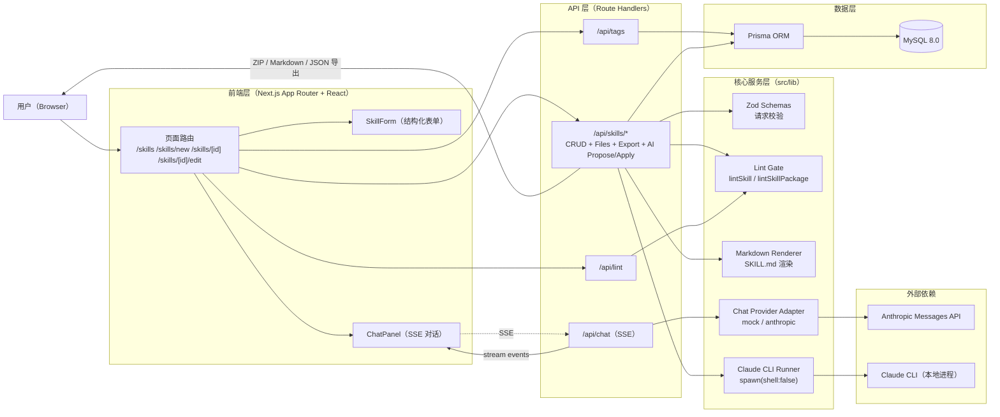
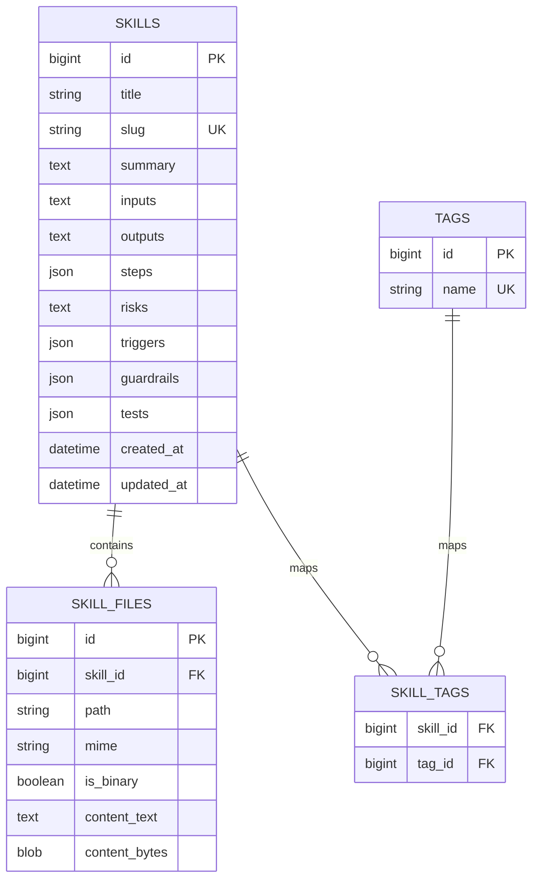
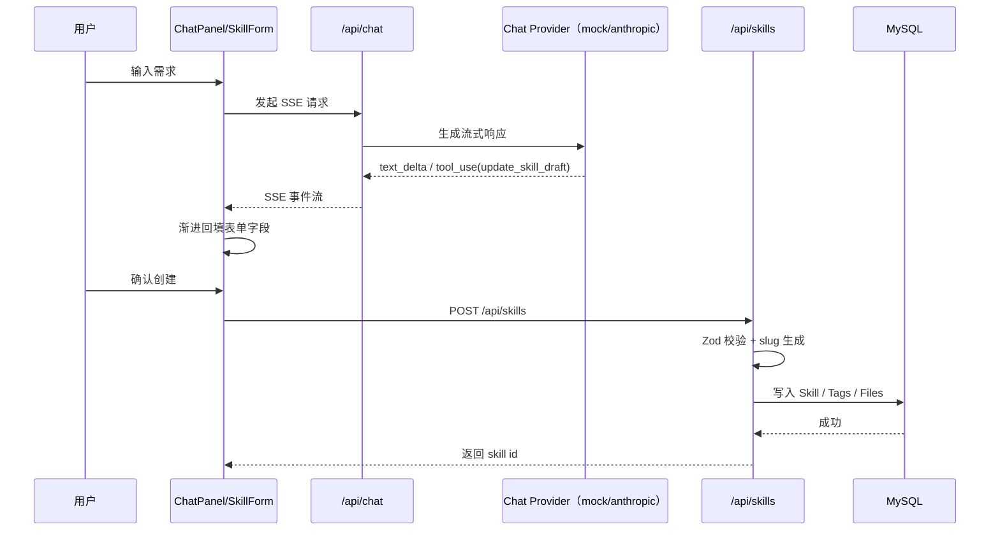
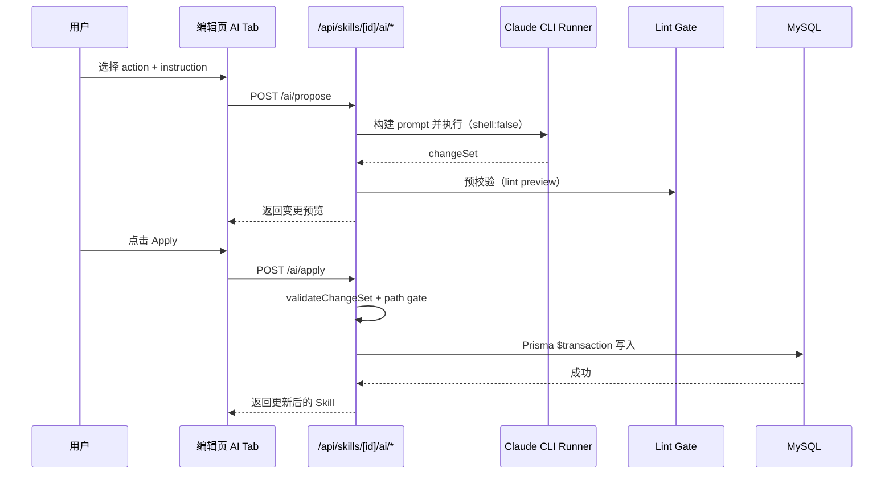

# Quant Skill Vault 架构图（Mermaid）

> 基于当前项目实现（Next.js + Prisma + MySQL + Chat Provider + Claude CLI）整理。

## 1. 总体架构图

## 2. 数据模型关系图

## 3. 关键流程图（对话式创建 + 实时回填）

## 4. 关键流程图（AI Tab：Propose → Apply）

