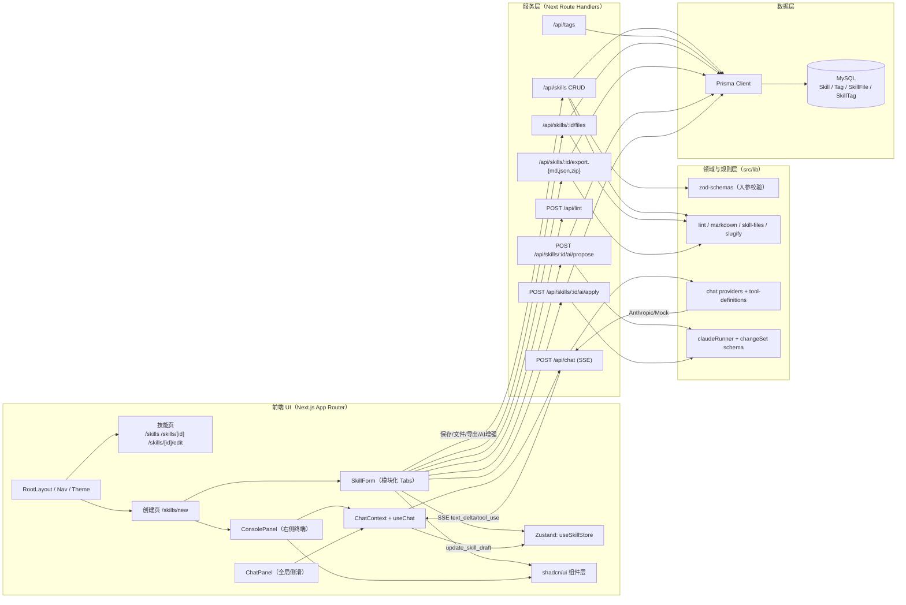
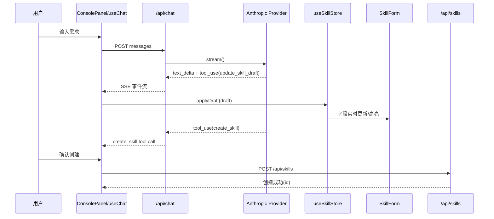
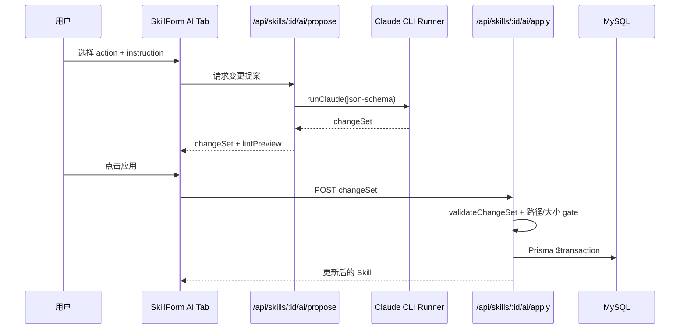

# Quant Skill Vault — 系统设计文档（更新版）

> 更新时间：2026-02-18
> 目标：用于后续需求讨论时，快速定位“改哪一层、改哪些模块、影响哪些流程”。

---

## 1. 系统目标与边界

Quant Skill Vault 是一个 Skill 协议管理平台，核心能力：
- 结构化创建与编辑 Skill（表单驱动 + 对话驱动）
- Lint 合规校验（字段约束 + 包级约束）
- 多格式导出（Markdown / JSON / ZIP）
- AI 增强（提案 Propose + 应用 Apply）

当前系统边界：
- 前端：Next.js App Router + React 19
- 服务：Next Route Handlers（Node runtime）
- 数据：Prisma + MySQL
- AI：
  - 对话流：Anthropic Messages API（SSE）
  - 编辑流：本机 Claude CLI（受控 spawn）

---

## 2. 总体架构图（当前实现）

---

## 3. 核心业务流程

### 3.1 对话式创建（SSE 实时回填）

### 3.2 编辑页 AI 增强（Propose -> Apply）

### 3.3 导出流程（Lint Gate 先行）

- `/export.md`：渲染 SKILL.md（含 frontmatter）
- `/export.json`：输出结构化 JSON
- `/export.zip`：`<slug>/SKILL.md` + supporting files
- 任一导出先经过 lint，失败返回 400 + errors

---

## 4. 数据模型（Prisma）

核心模型：
- `Skill`
- `Tag`
- `SkillTag`（多对多）
- `SkillFile`

关系：
- `Skill 1:N SkillFile`
- `Skill M:N Tag`（通过 `SkillTag`）

关键字段：
- `Skill.steps` / `triggers` / `guardrails` / `tests` 均为 JSON
- `Skill.slug` 唯一
- `SkillFile` 在 `(skillId, path)` 上唯一约束

---

## 5. 模块分层与职责

### 5.1 页面与布局层
- `src/app/layout.tsx`：全局布局、主题、全局 ChatPanel 容器
- `src/components/nav.tsx`：固定顶部导航
- `src/app/skills/new/page.tsx`：左表单 + 右终端双栏创建工作区

### 5.2 表单与状态层
- `src/components/skill-form.tsx`：编排层（请求、tab、保存、导出）
- `src/components/skill-form/*-tab.tsx`：分区 UI 子组件
- `src/components/skill-form/use-skill-form-validation.ts`：校验模型与 UI 状态计算
- `src/lib/stores/skill-store.ts`：Zustand 单一表单状态源

### 5.3 对话层
- `src/lib/chat/use-chat.ts`：SSE 消费、消息状态、工具调用路由
- `src/app/api/chat/route.ts`：SSE 事件转发
- `src/lib/chat/providers/*`：Anthropic / Mock 适配器
- `src/lib/chat/tool-definitions.ts`：`update_skill_draft` 与 `create_skill` 工具规范

### 5.4 规则与导出层
- `src/lib/lint.ts`：`lintSkill` / `lintSkillPackage`
- `src/lib/markdown.ts`：描述生成与 SKILL.md 渲染
- `src/lib/skill-files.ts`：supporting files 路径安全校验

### 5.5 AI 提案层（CLI）
- `src/lib/ai/claudeRunner.ts`：受控执行 Claude CLI（shell:false）
- `src/lib/ai/schema.ts`：ChangeSet JSON schema
- `src/app/api/skills/[id]/ai/propose/route.ts`
- `src/app/api/skills/[id]/ai/apply/route.ts`

### 5.6 数据访问层
- `src/lib/prisma.ts`：PrismaClient 单例
- API Route Handlers 作为应用服务层直接调用 Prisma

---

## 6. 关键约束与安全策略

- API 输入校验：Zod（创建/更新 Skill）
- 路径安全：仅允许 `references/ examples/ scripts/ assets/ templates/`
- 文件大小：文本 <= 200KB，二进制 <= 2MB
- AI Apply：先 `validateChangeSet`，后事务写库
- Claude CLI：`spawn(..., { shell:false })`，禁用内置工具
- 导出门禁：先 lint，后导出

---

## 7. 可维护性现状（已完成）

- SkillForm 已模块化拆分（Author/Triggers/Guardrails/Tests/Files/Enhance/Export）
- 校验逻辑已抽到独立 hook + 纯函数模型（含单测）
- 创建页工作区 UI：
  - 顶部导航固定
  - 左右分栏与分割线优化
  - 左侧操作栏（创建/取消）固定
  - 右侧终端与页面视觉风格统一

---

## 8. 后续需求落位建议（讨论模板）

你后续提需求时，可按下面格式给我，我能直接落到改动清单：

1. 目标场景：谁在什么页面做什么
2. 触发方式：按钮 / 快捷键 / API / 自动
3. 成功标准：用户可见结果 + 数据结果
4. 约束：是否影响导出规范、AI 流程、权限

我会按此输出：
- 改动层级（UI/API/Domain/Data）
- 精确文件清单
- 影响面与回归测试点
